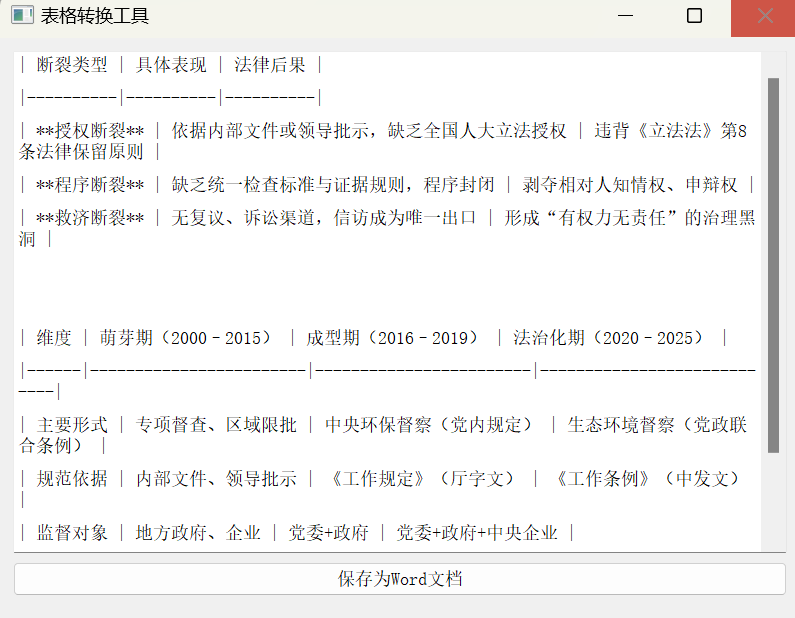
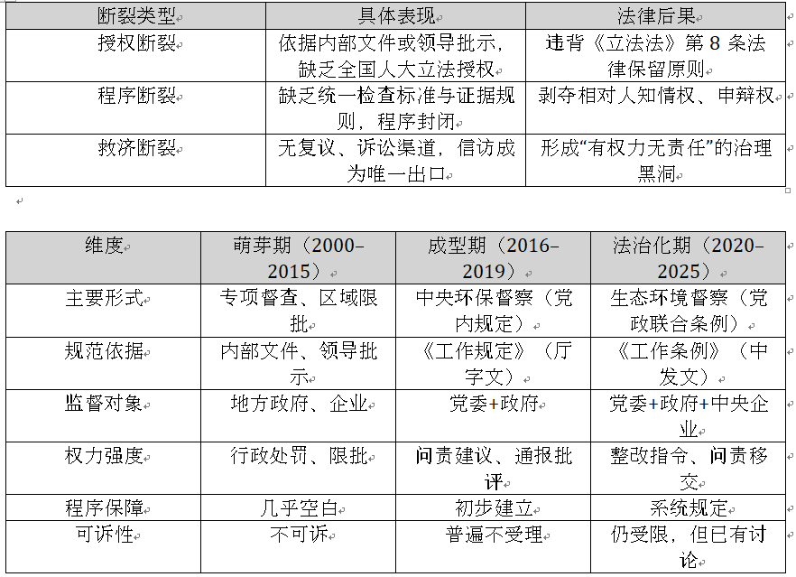

# Markdown表格转Word表格转换工具

## 环境要求
- Python 3.7+
- PyQt5
- python-docx
- cx_Freeze (仅打包需要)

## 安装
1. 克隆仓库：
```bash
git clone https://github.com/robin-fc/markdown-table-to-word-table.git
cd markdown-table-to-word-table
```

2. 安装依赖：
```bash
pip install -r requirements.txt
```

## 运行方式

### 方式1：直接运行
```bash
python table_converter.py
```

### 方式2：打包后运行
1. 执行打包：
```bash
python setup.py build
```
2. 打包完成后，可在`build`目录下找到可执行文件

## 使用说明
1. 启动程序
2. 在文本框中粘贴Markdown格式的表格
3. 点击"保存为Word文档"按钮
4. 选择保存位置，确认保存

## 支持的功能
- 支持标准Markdown表格语法
- 自动处理表格对齐
- 表头自动设置灰色背景
- 支持批量转换多个表格
- 自动移除Markdown加粗语法

## 注意事项
- 确保输入的表格符合标准Markdown语法
- 表格必须以`|`开头和结尾
- 建议使用UTF-8编码的文本

## 示例

输入md table文本点击保存，保存到指定目录



word中的结果

